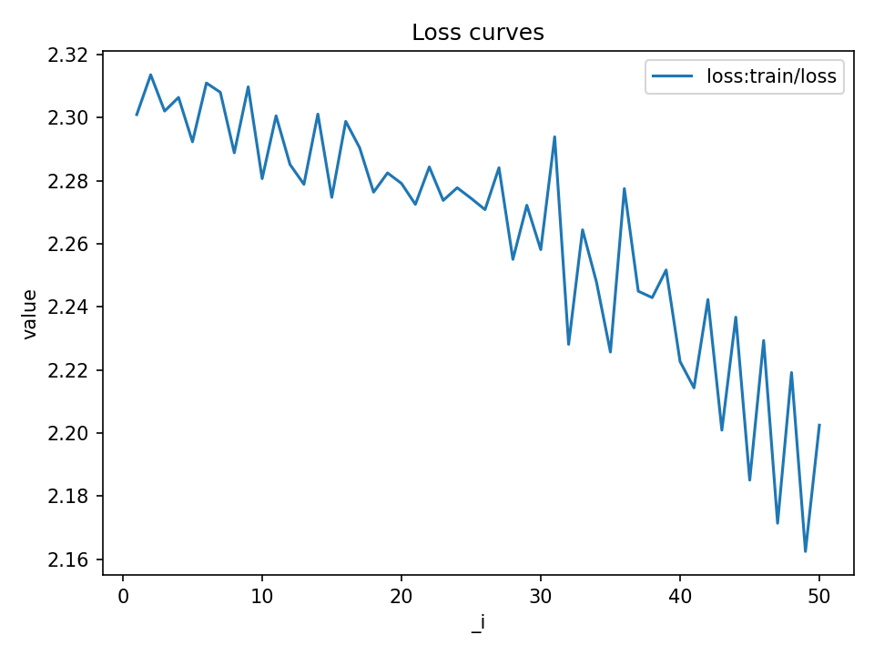
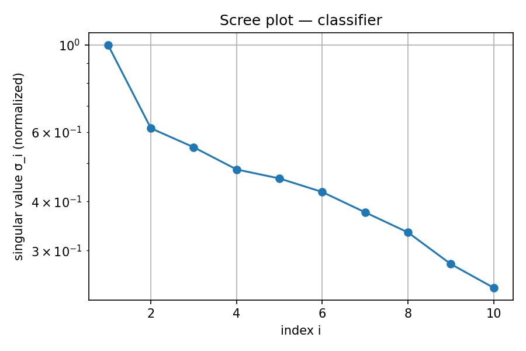

# Week 1 Baseline — TinyCNN on CIFAR-10 (subset 256)

**TL;DR.** TinyCNN (7,738 params) trained on a 256-example CIFAR-10 slice yields **val/acc = 13.64%** and **val/loss = 2.2267** (seed 11, CPU ~131s). Loss trends down modestly; classifier layer shows moderate conditioning with ~74% of energy in the top-5 singular values.

## Setup

- Data: CIFAR-10 (subset=256), batch_size=128, ToTensor only.
- Model: TinyCNN (params=7,738), dropout=0, lr=1e-3, wd=0, epochs=25.
- Seed: 11; Device: CPU.

## Headline results
| Metric      | Value     |
|-------------|-----------|
| val/acc     | **0.1364** |
| val/loss    | **2.2267** |
| params      | 7,738     |
| runtime     | ~131 s    |
| run_id      | id_writeup_baseline_1 |

## Figures

*Loss decreases ~2.31 → ~2.20 across ~50 steps; small but consistent, matching tiny model + tiny dataset.*

**Classifier scree (top-10, normalized)**: σ₁≈0.999; next ≈0.734, 0.630, 0.608, 0.600.
**Condition number** ≈3.04; **top-5 energy** ≈0.739.

## Interpretation
- **Training signal exists** but is weak at this scale (tiny net + 256 samples). No obvious overfit yet.
- **Classifier spectrum**: decays gently; moderate conditioning (cond≈3). Not collapsed or spiky. Capacity is limited but usable.
- **Next moves**:
1) Train longer and/or on full CIFAR-10; add simple augments.
2) Log val curves alongside train (add `val/loss` to the loss plot).
3) Try wd>0 and small dropout; sweep LR (5e-4, 1e-3, 2e-3).
4) Track scree over epochs to see if conditioning drifts.

## Reproduction
python -m ablation_harness.ablate
--config experiments/baseline.yaml
--out_dir runs/writeup_baseline
--seed 11

## Manifest
- Report: `docs/reports/wk1_baseline.md`
- Figures: `docs/assets/loss_baseline.png`, `docs/assets/scree_classifier.png`
- Run: `runs/logs/id_writeup_baseline_1` (contains `loss.jsonl`, `spectral_final.json`)
