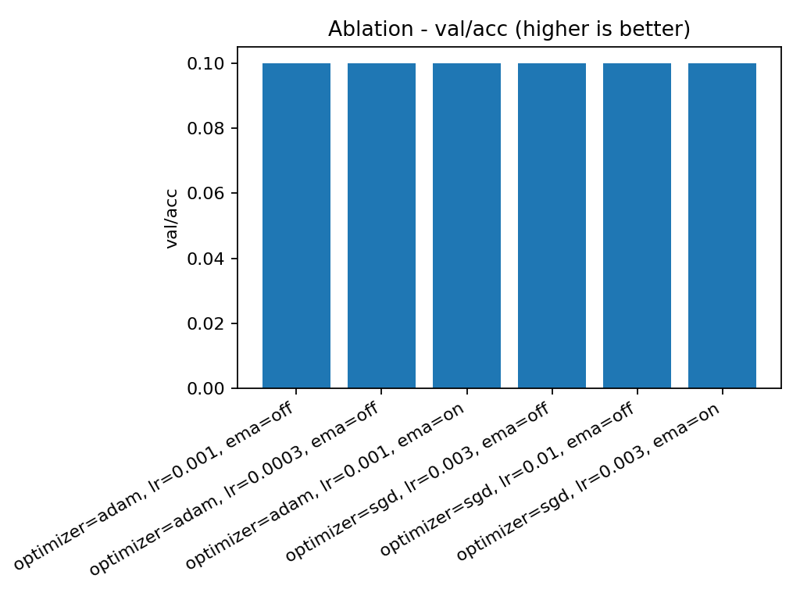
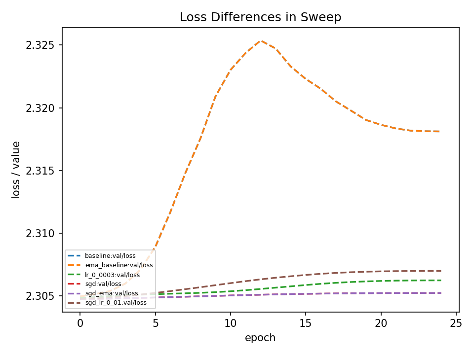
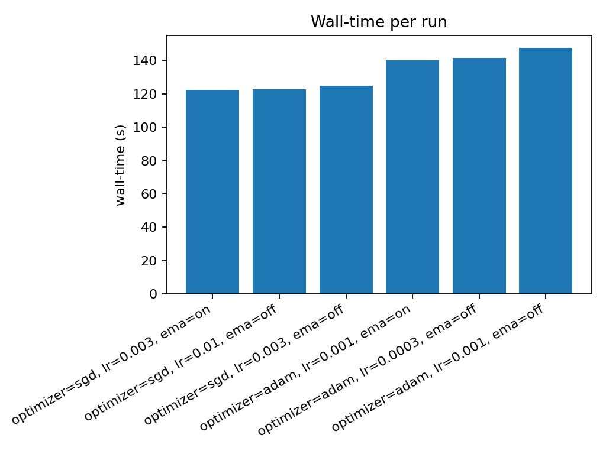

# Week 2 Sweep (TinyCNN)

This week I did a param sweep for the first time.

**TL:DR - Sweep results**
Winner: adam, lr 0.001, ema=off; with val/acc = 0.10% (+-0 noise (no additional seeds tested)), total wallclock time = 140 secs

### Setup:

Study: tinycnn_cifar_wk2
Goal: max val/acc
Metric(s): val/acc, val/loss

Results: runs/wk2_param_sweep/results.jsonl

Varients: {adam 1e-3}, {adam 3e-4}, {adam+ema 1e-3}, {sgd 1e-2}, {sgd 3e-3}, {sgd + ema}

Why: Walltime margianlly worse, but loss curve shows less stagnation (though still does not show val/acc above random guessing).

Potential action for next week: Trial new sweeps with cfg 1; run mini-sweep on epochs vs val/acc, maybe also with different lr's.

# Ablation results

- **Source:** `runs/wk2_param_sweep/results.jsonl`
- **Metric:** `val/acc` (maximize)

| config | optimizer | lr | wd | ema | val/acc | _elapsed_sec |
|---|---|---|---|---|---|---|
| 1| adam| 0.001| 0.0| off| 0.100| 147.7 |
| 2| adam| 0.0003| 0.0| off| 0.100| 141.5 |
| 3| adam| 0.001| 0.0| on| 0.100| 140.1 |
| 4| sgd| 0.003| 0.0005| off| 0.100| 124.7 |
| 5| sgd| 0.01| 0.0005| off| 0.100| 122.8 |
| 6| sgd| 0.003| 0.0005| on| 0.100| 122.2 |

- Note, the 1.0 val/acc in all cfgs tied (random guessing).

## Plots:
- ## Ablation table & best-config highlight:

 

- ## Loss curves (val):

- ## Wall-time bars:

Acc vals are espeically notable: all are level at random chance (1.0). It appears this TinyCNN regardless of these paramaterizations does not generalize until 50+ epochs as demonstrated in prev expereiments.
So no major desion can be made on final results, only trends.
No overfitting signs.

## Cost & Gain comparasions:
- Accuracy delta vs baseline: <0 pts>
- Time delta vs baseline: ~±5%
- Stability: curve is unstable but smooth / varies less at later epochs

Keep / Drop / Tune
- Keep: adam, lr 0.001 seems good baseline
- Drop: sgd, results are flat and do not appear promising with this model & ema, difference with/without ema not apparent in any cfg.
- Tune next (micro-sweep): e.g., LR around winner (×/÷2), then small WD grid (0, 5e-4, 1e-3).
- EMA: Keep if ≥~1 pt better or consistently smoother late; otherwise drop for simplicity.

Some notes:
- Tiny train set (256) ⇒ noisy val; compare relative gaps, not absolutes.
- TinyCNN requires 50+ epochs to raise val/acc

## REPRODUCEABILITY:

Starting run command:
    python -m ablation_harness.ablate --config experiments/study_wk2.yaml --out_dir runs/wk2_param_sweep

for the aggregation table:
    python -m scripts.aggregate runs/wk2_param_sweep/results.jsonl --metric val/acc --timing _elapsed_sec --out reports/study_wk2.md

for the loss plotter:
  python -m ablation_harness.plot_loss \
  runs/logs/baseline/loss.jsonl \
  runs/logs/ema_baseline/loss.jsonl \
  runs/logs/lr_0_0003/loss.jsonl \
  runs/logs/sgd/loss.jsonl \
  runs/logs/sgd_ema/loss.jsonl \
  runs/logs/sgd_lr_0_01/loss.jsonl \
  --labels baseline ema_baseline lr_0_0003 sgd sgd_ema sgd_lr_0_01 \
  --metrics 'val/loss' \
  --out runs/wk2_param_sweep/loss \
  --xkey epoch --title "Loss Differences in Sweep"

for the plot walltime:
    python -m ablation_harness.plot_walltime \
    runs/wk2_param_sweep/results.jsonl \
    --label-keys optimizer lr ema \
    --out runs/wk2_param_sweep/plots

for the plot ablation:
    python -m ablation_harness.plot_ablation runs/wk2_param_sweep/results.jsonl --metric val/acc --goal max --label-keys optimizer lr ema \
    --out runs/wk2_param_sweep/plots
