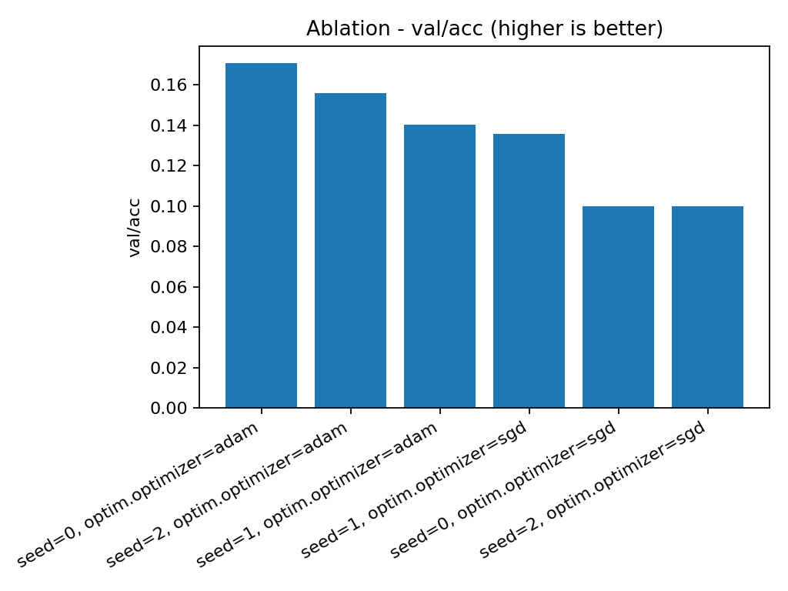
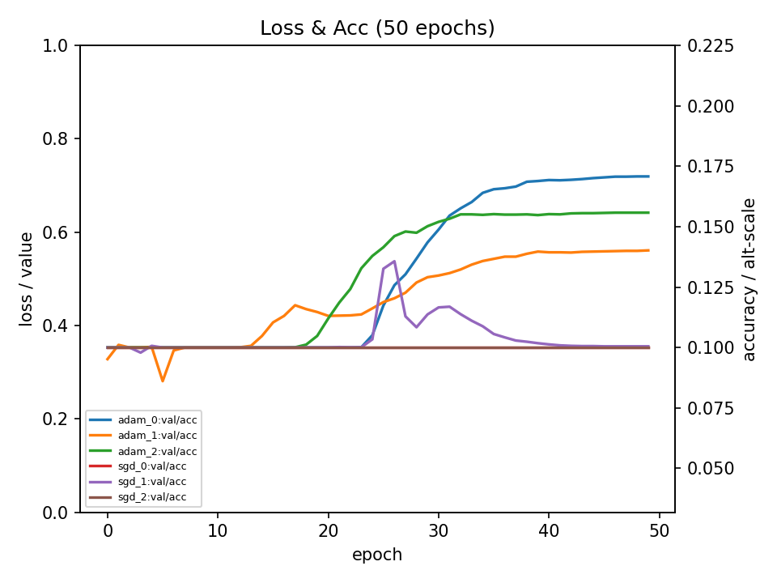
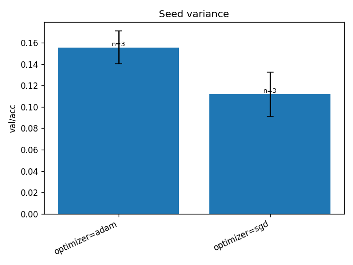
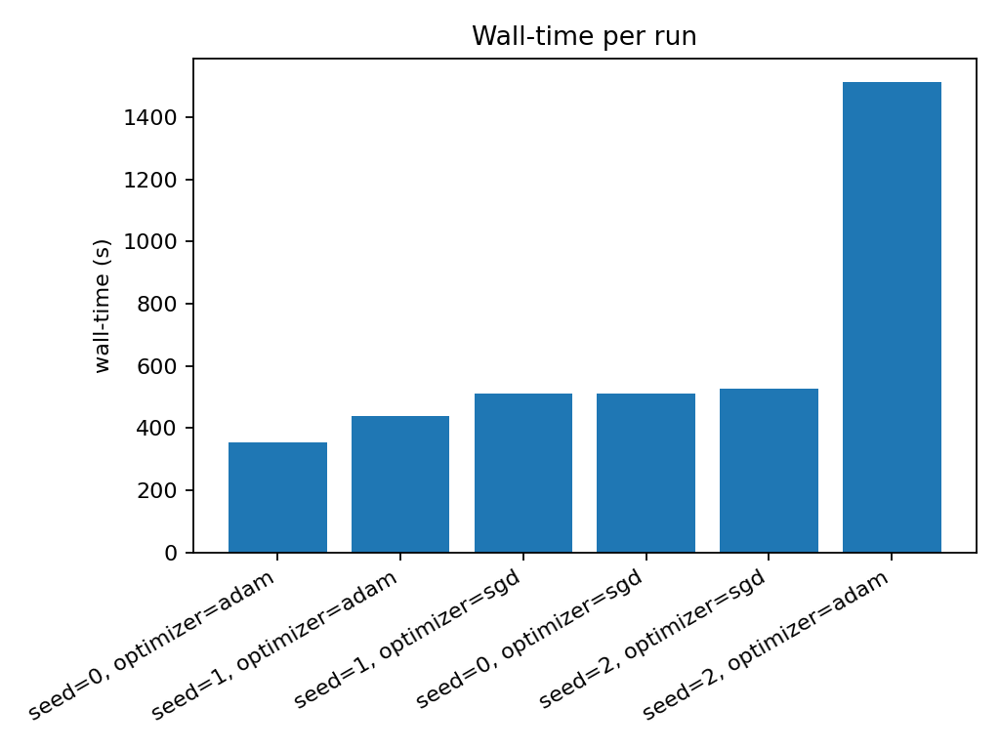

## Week 3 — Seed Stability on TinyCNN (CIFAR‑10 slice)

TL;DR. Seed variance is: within 0.2%, decision, keeping Adam lr 0.001 as baseline, dropping SGD (stagnant and unstable val/acc). Next step, compare Adam at (a: longer epochs or (b slightly different lr or (c larger data slices.

# Setup:

Configs: Adam (lr=1e‑3, wd=0, ema=off) and SGD (lr=1e‑2, wd=5e‑4, ema=off); Seeds: {0,1,2}; Epochs: 50; Batch: 128.

Primary metric: val/acc (maximize). Secondary: val/loss, _elapsed_sec.

Hypothesis H1: Mean val/acc is stable within ±2% across seeds for each config.

Analysis plan: Aggregate mean±std; variance bar / CI plot. Deviations: none planned.

Data: CIFAR‑10, subset=256 (same as Wk1/2), batch_size=128, transforms: ToTensor only.

Model: TinyCNN (≈7.7k params), dropout=0.

Train schedule: 50 epochs, no LR schedule.

Optimizers compared:

Adam: lr=1e‑3, wd=0, ema=off.

SGD: lr=1e‑2, wd=5e‑4, momentum=0.9 (if used), ema=off.

Seeds: 0,1,2. Device: CPU.

# REPRODUCABILTY (single shot!):

Running command:

    python -m ablation_harness.cli run \
    --config experiments/study_wk3.yaml \
    --metric val/acc --goal max \
    --out_dir runs/wk3_seed_sweeps

1) Ablation plot (plotting cfg bars vs other cfg bars):

    

    python -m ablation_harness.plot_ablation \
    runs/wk3_seed_sweeps/results.jsonl \
    --metric val/acc \
    --goal max \
    --label-keys seed optim.optimizer \
    --out runs/wk3_seed_sweeps/plots

2) Aggregate (does not auto aggregate seeds mean+std, done mannually):

    python -m scripts.aggregate \
    runs/wk3_seed_sweeps/results.jsonl \
    --metric val/acc \
    --goal max \
    --cols seed optim.optimizer \
    --timing _elapsed_sec \
    --out reports/wk3_ablation.md

3) Loss Plots:

    

    python -m ablation_harness.plot_loss \
    runs/wk3_seed_sweeps/wk3_seed_sweeps/wk3_seed_sweeps__tinycnn__cifar10__dro0__adam__lr0.001__wd0__ema0__seed=0/loss.jsonl \
    runs/wk3_seed_sweeps/wk3_seed_sweeps/wk3_seed_sweeps__tinycnn__cifar10__dro0__adam__lr0.001__wd0__ema0__seed=1/loss.jsonl \
    runs/wk3_seed_sweeps/wk3_seed_sweeps/wk3_seed_sweeps__tinycnn__cifar10__dro0__adam__lr0.001__wd0__ema0__seed=2/loss.jsonl \
    runs/wk3_seed_sweeps/wk3_seed_sweeps/wk3_seed_sweeps__tinycnn__cifar10__dro0__sgd__lr0.01__wd5e-04__ema0__seed=0/loss.jsonl \
    runs/wk3_seed_sweeps/wk3_seed_sweeps/wk3_seed_sweeps__tinycnn__cifar10__dro0__sgd__lr0.01__wd5e-04__ema0__seed=1/loss.jsonl \
    runs/wk3_seed_sweeps/wk3_seed_sweeps/wk3_seed_sweeps__tinycnn__cifar10__dro0__sgd__lr0.01__wd5e-04__ema0__seed=2/loss.jsonl \
    --metrics  val/acc \
    --out runs/wk3_seed_sweeps/loss_plots \
    --labels adam_0 adam_1 adam_2 sgd_0 sgd_1 sgd_2 \
    --xkey epoch --title "Loss & Acc (50 epochs)"

4) Variance plot

    python -m ablation_harness.plot_variance \
    runs/wk3_seed_sweeps/results.jsonl \
    --metric val/acc \
    --label-fields optim.optimizer \
    --out runs/wk3_seed_sweeps/plots/seed_variance

5)  Walltime plot

    python -m ablation_harness.plot_walltime \
    runs/wk3_seed_sweeps/results.jsonl \
    --label-keys seed optim.optimizer --out runs/wk3_seed_sweeps/plots

# 4) Results

4.1 table (mean ± std across seeds)

**Source:** `runs/wk3_seed_sweeps/results.jsonl`
**Metric:** `val/acc` (maximize)

| config | seed | optim.optimizer | val/acc | _elapsed_sec |
|---|---|---|---|---|
| 1| 0| adam| 0.171| 354.4 |
| 2| 2| adam| 0.156| 1513.1 |
| 3| 1| adam| 0.140| 439.6 |
| 4| 1| sgd| 0.136| 510.0 |
| 5| 0| sgd| 0.100| 511.6 |
| 6| 2| sgd| 0.100| 525.4 |

Adam: 15.6% ± 1.6%
SDG: 11.2% ± 2.1%.

Mean val/acc still chance on all sgd outcomes (even sgd 1's is unstable and normalizes to 0.10 in further training). Adam's all show learning, later increases in val/acc seem coorelated to higher final val/acc (may investigate further, may be small n).

Adam's best: 0.171 (seed 1).

An aside: Adam's runtimes are widely variable (why not diagnosed, may be ram issues with hardware or overheating).

4.2 Figures:

Seed variance plot: 

Wall‑time bars: 

# 5) Interpretation:

H1 (±2% stability) outcome: [[pass/fail]] with adam: [[..]]; sgd: [[..]].

Optimizer specific: Adam 0, 1 & 2 shows a consistent gaining curve with signs of late plateau, while SDG's are stangnant (0, 1) or collapse (2).

Training dynamics: this TinyCNN shows again low response to training signal with a requirement of 10-25 epochs to start increaing val/acc, and a likely plateau of ~1.75 val/acc at n=3 with Adam lr 0.001 (not much beyond random guessing).

Runtime note: Adam shows extremely volitle runtime (+-7 mins, 50 epochs). Compute cost not recorded.
SDG's is less than -+1 minute.

Unknown if these values would hold to more data/noisier training, given the low val/acc on even such a small subset, would likely preform poorly or not at all.
